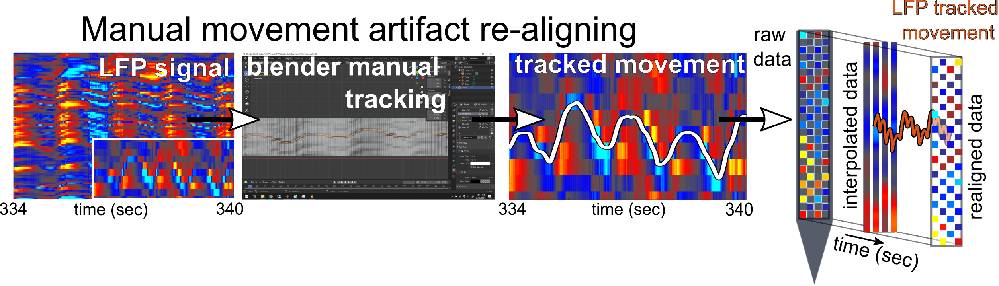
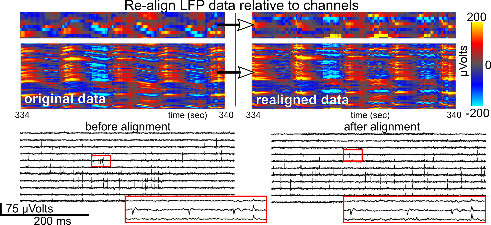

# CorticalNeuropixelProcessingPipeline

This is code and instructions for the exatraction of the Neuropixels LFP data to then perform manual tracking and interopolation to handle  of human Neuropixels recordings for the paper: "Large-scale recordings of individual neurons in human cortex  using high-density Neuropixels probes" by Paulk et al., preprint located at .... (will change with the preprint submitted)

The main_pipeline.m code is the export of Neuropixels LFP (local field potential) signals within a specific range of channels which show the movement-induced artifact most clearly (see below) from MATLAB to an STL file (top half of the Export_STL_and_Load_CSV.m code). A manual tracing step occurs in blender (https://www.blender.org/) due to the ease of use of the blender program versus other manual tracing aprpoaches.  Following manual tracing and checking the tracing follows the dips in voltage indicating a moving neural signal, the subsequent traced lines are then imported back into MATLAB from a .csv file and used to interpolate the LFP and AP (action potential) data across the recordings. 

The code used for the processing is laid out in a main, single MATLAB file "main_pipeline.m", which includes the following steps:
1. Export_STL.m - script to export LFP to .stl in MATLAB
2. Blender manual tracking (with descriptions in the README below)
3. exportingCSVinfoExample.py - python code used in blender to export the manual tracking
4. Load_CSV_from_blender.m - script to import the blender .csv output and check the manual tracking against the LFP for the alignment
5. Neuropixel_AP_preProcessing.m - script to preprocess the AP band to be ready for interpolation
6. Intarpolate_and_align_AP.m - script interpolation of the AP band step- the output from this step can be put into Kilosort 3.0
7. Kilosort 3.0 (https://github.com/MouseLand/Kilosort) to spike sort the manually realigned data without additional registration by Kilosort 3.0.
8. PHY2 for the identification of MUA versus single unit activity (https://github.com/cortex-lab/phy)
9. extract_waveform_with_metrics.py - takes the output from Kilosort and extracts the waveforms and the performs a series of measurements on the output waveforms which can be read into MATLAB, closely following the code from (https://github.com/AllenInstitute/ecephys_spike_sorting/tree/master/ecephys_spike_sorting/modules/mean_waveforms)Source: Jia et al. (2019) "High-density extracellular probes reveal dendritic backpropagation and facilitate neuron classification." J Neurophys 121: 1831-1847

# Manual step in Blender : 
This section was to export the LFP into .stl files which can be imported as surface files into blender (https://www.blender.org/). Below is the series of steps for manual tracing:

1. Importing the files into blender involves using the .stl Add-on (Import-Export: STL input) which generates a blender object plane of channel x time  with the peaks and valleys (topography) the voltage of the signal. 
2. Within blender, to make the shifting sinks and peaks more visible, the channels axis is expanded to 400-1000 pixels (depending on how many channels are imported into blender) without changing the long axis of the surface (which is in time) or the voltage axis (imports as the z-axis). 
3. Then, based on the peaks and valleys of the distinctive LFP, we added a Stroke using GreasePencil to trace the movement artifact manually.
4. Once the entire recording was traced using this tool, we converted the traced Stroke into a Line then into an Object and used custom python code (exportingCSVinfoExample.py) to export the vertices of the traced Line into a .csv file

Import of the traced lines into MATLAB is in the main_pipeline.m code from lines 38 onward, using the Load_CSV_from_blender.m script.

This traced information then can be used to interpolate the voltage across channels to then adjust for the movement artifact through time for both the LFP and AP channels.

